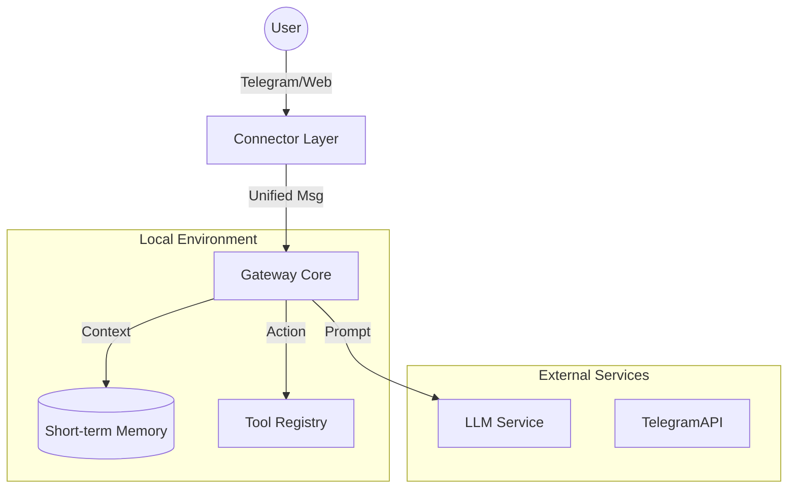

# Moltbot Lite 專案規劃書

> **文件狀態**: 草稿 (Draft)
> **負責角色**: Oracle - 架構設計 / Librarian - 文件整理
> **日期**: 2026-01-28

## 1. 專案願景 (Vision)

**Moltbot Lite** 旨在打造一個**極簡、本地優先、可擴充**的個人 AI 助理閘道器 (Gateway)。
參考原版 `moltbot` 的核心精神，但在初期去除複雜的 Docker 沙盒、語音與多餘的通訊協定，專注於建立一個穩固的「對話中樞」，讓開發者能透過熟悉的通訊軟體（如 Telegram）與自己的私有 AI 代理進行互動與工具調用。

## 2. 核心架構 (Architecture)

本專案採用 **Hub-and-Spoke (軸輻式)** 架構，以 Gateway 為中心，連接「輸入端 (Connectors)」與「處理端 (Agents)」。



### 2.1 關鍵模組

1.  **Gateway Core (中樞)**
    *   **職責**: 負責訊息路由、維持對話狀態、調度 LLM 與工具。
    *   **技術**: Node.js (TypeScript) + RxJS (處理非同步訊息流)。

2.  **Connectors (連接器)**
    *   **Telegram Bot**: 首選實作。支援 Webhook/Long Polling，提供手機端的原生體驗。
    *   **Console/CLI**: 開發除錯用，直接在終端機對話。

3.  **Brain (大腦)**
    *   **LLM Client**: 封裝 OpenAI / Anthropic API。
    *   **Router**: 簡單的關鍵字或語意判斷，決定是否觸發特定工具。

4.  **Tools (能力)**
    *   **標準介面**: 定義 `name`, `description`, `execute()`。
    *   **MVP 工具**:
        *   `get_current_time`: 獲取系統時間。
        *   `web_search`: Google Search API (Tavily/Serper)。
        *   `file_reader`: 讀取本地指定目錄的文件。

## 3. 技術棧選型 (Tech Stack)

| 領域 | 選擇 | 理由 |
| :--- | :--- | :--- |
| **Runtime** | **Node.js (TypeScript)** | 生態系豐富，適合處理 I/O 密集型任務 (Chat bot)。 |
| **Database** | **SQLite (Better-SQLite3)** | 單一檔案，無需 Docker 即可運作，效能優異。 |
| **LLM SDK** | **Vercel AI SDK / LangChain** | 統一不同模型介面，方便切換。 |
| **Package Manager** | **pnpm** | 快速且節省磁碟空間。 |

## 4. 開發路線圖 (Roadmap)

### 階段一：基礎建設 (Foundation) - 基礎建設
*   [ ] 初始化 TypeScript 專案結構。
*   [ ] 實作 **Telegram Connector** (接收與發送訊息)。
*   [ ] 建立 **Echo Bot**：驗證訊息迴路暢通。
*   [ ] 實作 **WhiteList**：僅允許特定 User ID 互動。

### 階段二：大腦 (The Brain) - 接入智能
*   [ ] 整合 OpenAI/Anthropic API。
*   [ ] 設計 **Conversation Memory**：使用 SQLite 儲存最近 20 輪對話。
*   [ ] 實現基本的「聊天機器人」功能。

### 階段三：工具層 (Tools) - 工具調用
*   [ ] 設計 **Tool Interface**。
*   [ ] 實作 Function Calling 機制 (讓 LLM 決定何時呼叫工具)。
*   [ ] 實作第一個工具：`web_search`。

## 5. 檔案結構預想

```
src/
├── core/
│   ├── gateway.ts      # 主訊息迴圈
│   ├── memory.ts       # 對話紀錄管理
│   └── llm.ts          # LLM 呼叫封裝
├── connectors/
│   ├── telegram.ts     # Telegram 配接器
│   └── console.ts      # CLI 配接器
├── tools/
│   ├── base.ts         # 工具介面定義
│   └── builtins/       # 內建工具 (Time, Search)
├── types/              # 共用型別定義
└── main.ts             # 程式入口
```

## 6. 下一步行動 (Next Steps)
1.  建立專案資料夾。
2.  安裝基礎依賴 (`typescript`, `telegraf`, `dotenv`).
3.  編寫 `src/main.ts` 與 `src/connectors/telegram.ts`。
